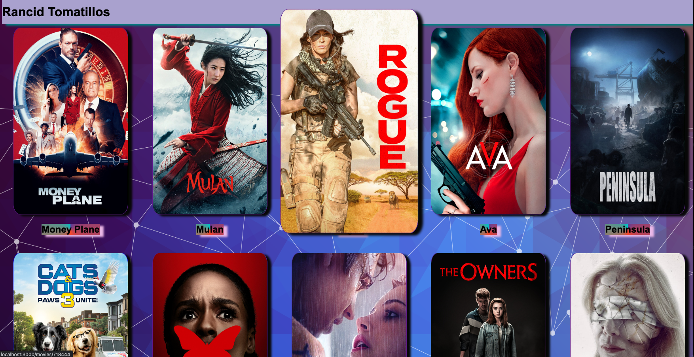

# Rancid Tomatillos
## Contributors: [Patrick Becker](https://github.com/PatrickGBecker) & [Ana Bennett](https://github.com/AnaBennett11)

### Technologies Used:
- React
- Router
- Cypress
- JavaScript
- CSS/JSX
- Heroku API
- GitHub
- NPM
- Figma
- Trello

### Deployed Link
- link goes here

### Visual Demo

### Planning
- Utilized Figma to create a wireframe and Trello for a project board to organize user stories and gather inspiration to create our own project. 

### Challenges
- We had to learn React, Router and Cypress asynchronously for the first time ever. 
- We had to plan if a component would be functional or class based. 
- We avoided using hooks to further our understanding in class based components. -Switching from single page UX to multipage UX.

### Wins
- We successfully implemented Acceptance and E2E testing in Cypress. 
- Successfully implemented functionality and full DOM manipulation with React and Router.
- Fully integrated API network requests with error handling into the app 
- Successfully coordinated asychronous and paired coding. 

### Possible Future extensions
-Add movie trailer viewing functionality and display
-Search feature to filter and find movies

